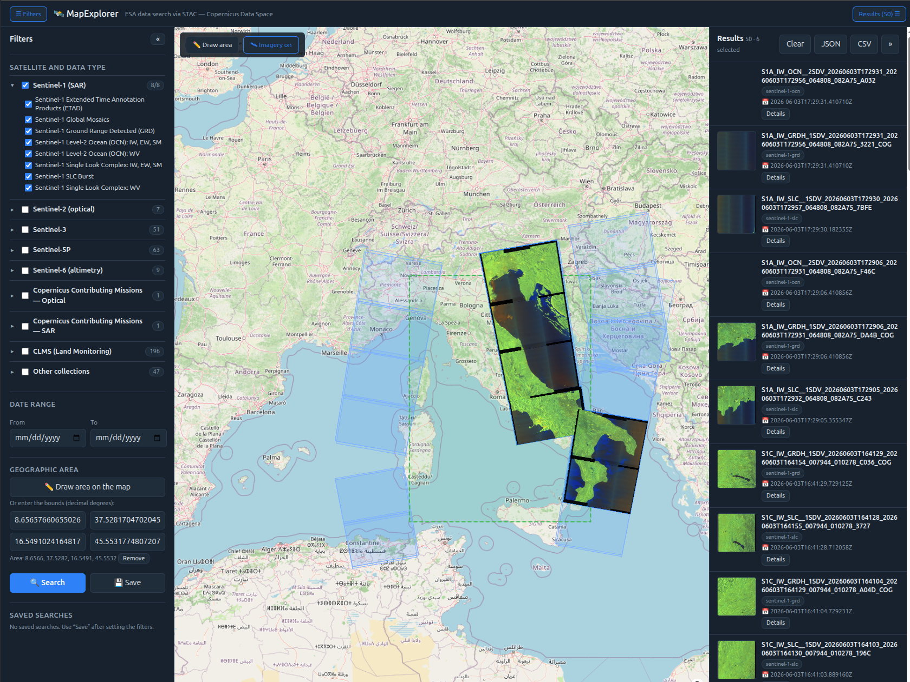

# MapExplorer — ESA data search portal via STAC

[](https://github.com/bbrauzzi/map-explorer/actions/workflows/ci.yml)
[](https://bbrauzzi.github.io/map-explorer/)
[](LICENSE)
[](https://react.dev)
[](https://www.typescriptlang.org)
[](https://vite.dev)

Web app for simple, filtered exploration of the **Copernicus Data Space Ecosystem
STAC catalog** (ESA data: Sentinel-1/2/3/5P/6, Copernicus Contributing Missions,
CLMS, ...).

**🌍 Live demo:** <https://bbrauzzi.github.io/map-explorer/>



## Features

- **Advanced search with filters**: date range, geographic area (bbox),
  satellite/mission and data type (STAC collection), maximum cloud cover.
- **Results on a map and in a list**, with synchronized selection and hover.
- **Preview** of images (thumbnail/quicklook) and metadata, including the raw STAC JSON.
- **Saved searches** in the browser (localStorage), reloadable.
- **Export** of the current result metadata to **JSON** (GeoJSON FeatureCollection) and **CSV**.
- **Collapsible side panels** and **expandable/collapsible mission groups** to keep the
  hundreds-of-collections catalog manageable.

## Stack

React + Vite + TypeScript, map with MapLibre GL (`react-map-gl`). No backend.

## Getting started

```bash
npm install
npm run dev      # http://localhost:5173
npm run build    # typecheck + production build into dist/
```

## Data source

STAC API: `https://stac.dataspace.copernicus.eu/v1` (STAC v1.0.0, CQL2).
Search, browse, and previews are public; **downloading products** requires Copernicus
authentication (out of scope for this portal).

### Note on CORS

In **development**, requests go through Vite proxies (`/stac` → STAC API, `/thumb` →
quicklook host), configured in `vite.config.ts`, so everything loads same-origin.

In **production** (e.g. GitHub Pages) no proxy is needed for data: the STAC API at
`https://stac.dataspace.copernicus.eu/v1` sends `Access-Control-Allow-Origin: *`, so the
app calls the absolute endpoint directly (see `src/config.ts`).

The one catch is **quicklook thumbnails**: their hrefs point at `datahub.creodias.eu`,
which 301-redirects to the same path on `zipper.creodias.eu`. Only the final response
carries CORS headers — the redirect itself does not — so a cross-origin WebGL texture
fetch is blocked on the redirect hop. In prod the app rewrites the host straight to
`zipper.creodias.eu` to skip the redirect (`thumbForMap` in `src/components/MapView.tsx`).
If CreoDIAS ever changes that mapping or gates `zipper` behind auth, fall back to a small
reverse proxy (e.g. the `/thumb` rule from `vite.config.ts` on Nginx/Cloudflare Worker).

## Structure

```
src/
  api/stac.ts            # STAC client: collections (paginated) + search + pagination
  config.ts              # endpoint, mission/collection grouping
  types/stac.ts          # STAC types and search parameters
  hooks/                 # useCollections, useStacSearch, useSavedSearches
  utils/                 # cql2 (filters), bbox (geometry/validation), export (JSON/CSV)
  components/            # FilterPanel, MapView, ResultList, ItemDetail, SavedSearchesPanel
  App.tsx                # 3-zone layout and shared state
```

## License

Released under the [MIT License](LICENSE).
